# SupermercadoOnline
Tienda Online, MVC, librerías de clases, en ASP.Net C#.


## ¿Qué hace la aplicación?

La pagina Web muestra una plataforma de compra y venta de productos de la canasta familiar. En la imagen-1 se muestra el catalogo de productos disponibles.

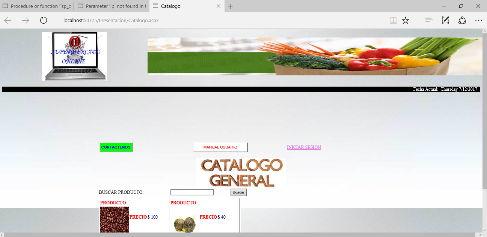

En la plataforma Web se puede registrar cualquier usuario con los datos requeridos: nombre, apellidos, correo, etc. (imagen-2) Y además de ingresar, cómo usuario usuario ya registrado.

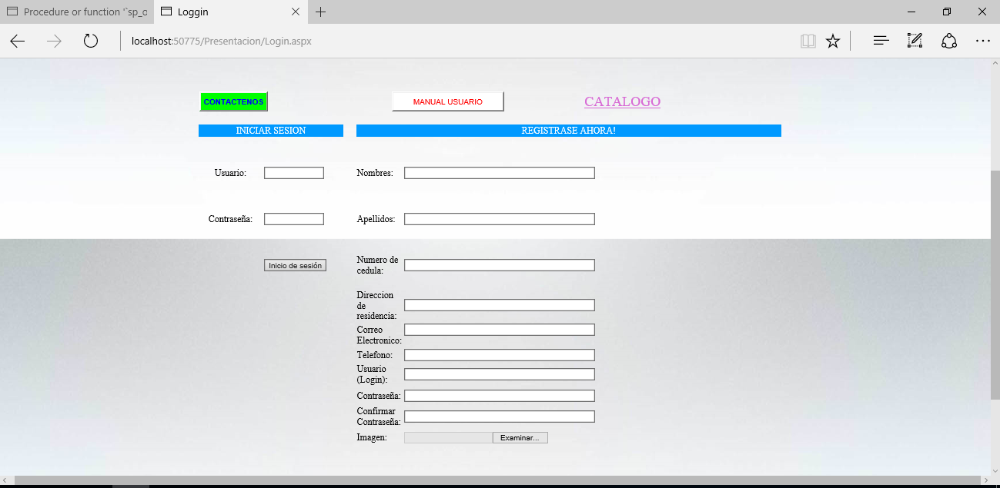

Al ingresar se muestra una alerta de ingreso según el rol (administrador, cajero o cliente), en este caso el rol es cliente. (Imagen-3)

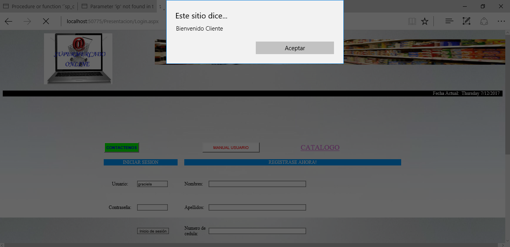

El cliente tiene varias opciones: ver su carrito de compras o comprar productos, cómo se muestra en la imagen-4.

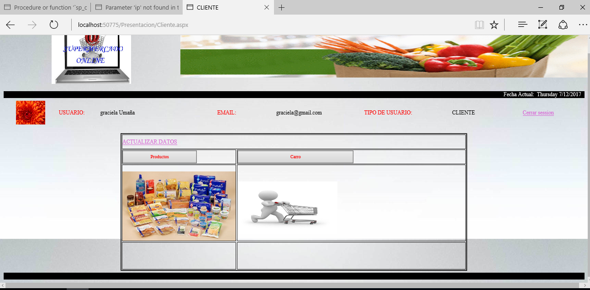

En la imagen-5 se muestra el formulario del carrito de compras, el cual esta vacio.

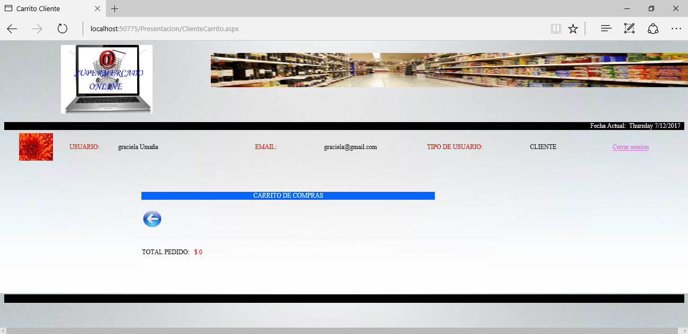

En la imagen-6 se muestra los productos disponibles en la tienda online, con su respectivo nombre, cantidad, foto y precio. En la imagen se observa que se compra dos productos de café.

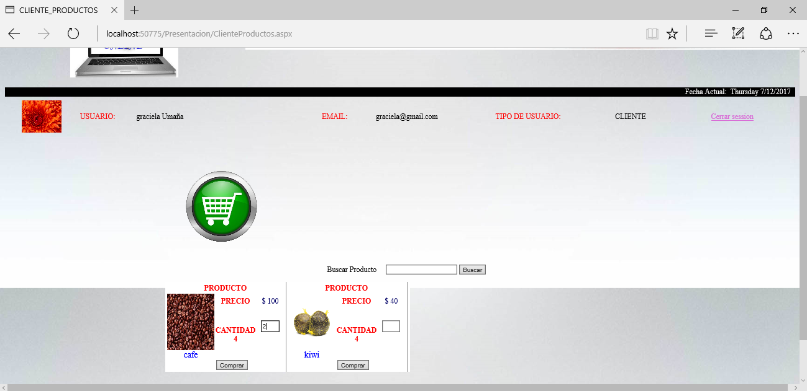

Al regresar al formulario del carrito, se observa la cantidad del producto que se compro anteriormente. Para apartarlo presionamos en "APARTAR PRODUCTOS". (imagen-7)

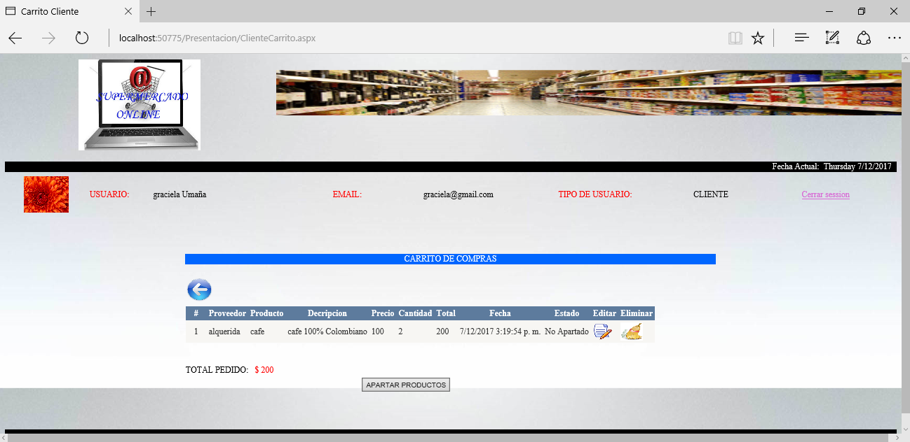

Antes de continuar, en el carrito de compras se puede modificar la cantidad del producto que se va a comprar, por si el cliente quiere disminuir o aumentar la cantidad, por pura decisión repentina. (imagen-8)

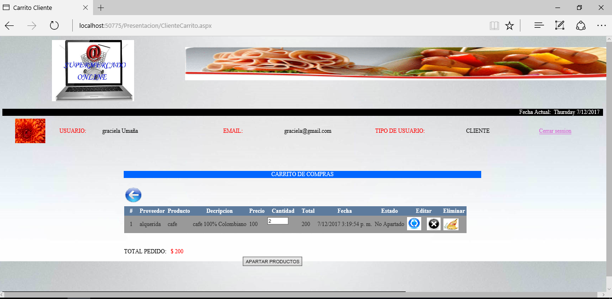

El cajero se encarga de entregar los productos apartados. (imagen-8)

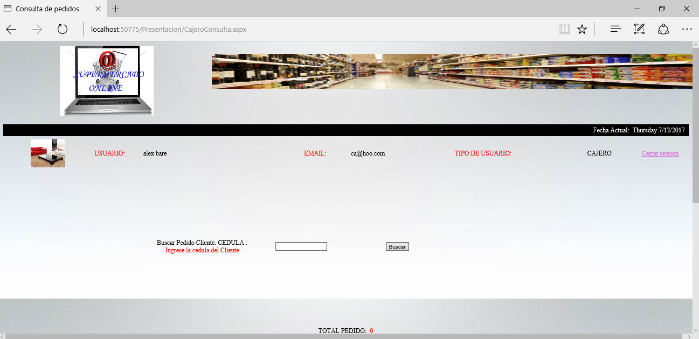

Por medio del número de cedula consulta los pedidos y vende los productos. (imagen-10)

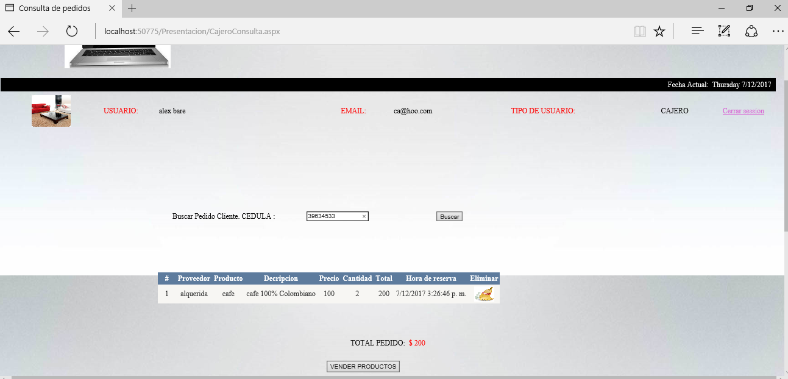

Finalmente se completa la compra. (imagen-11)

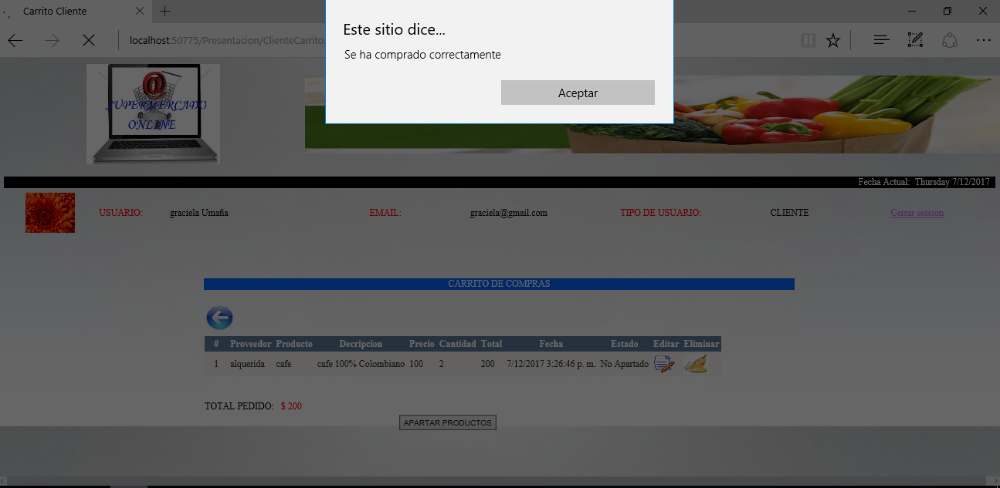


## ¿Qué muestra la aplicación?

En la Página web muestra diferentes formularios funcionales del SupermercadoOnline. En ``` cd SuperMercadoOnline/WebSite/Presentacion``` muestra los .aspx o formularios de cada rol de la aplicación como el administrador, cajero y cliente. El administrador puede agregar cajeros, productos, proveedores, etc., el cajero puede consultar los productos, generar el recibo, etc., y por ultimo el cliente agrega productos al carrito de compras, escribe un mensaje, etc.

También esta la carpeta .../LogicaPresentacion donde se almacena la logica o los aspx.cs de cada formulario. La carpeta .../Imagenes, .../Crystal donde se guardan la estructura de los reportes, por otro lado esta la pagina principal "_ index.apsx", etc.

En la ruta ``` cd SuperMercadoOnline``` muestra las librerías de clase que se utilizan por seguridad para el aplicativo como: DataC, EncapsularC, LogicaC, UtilitarioC. Además cuenta con:

 -Componentes de clases.
 -MutliIdioma.
 -Bloqueo de sesión (máximo 3 intentos) y Sesiones activas en 3 computadores (máximo).


La carpeta ``` cd Base_de_datos``` hay dos versiones realizadas en el Sistema Gestor de Base de datos (SGBD) MySQL y PostGreSQL, la primera contiene almacenado los datos de todos los componentes de los formularios y su tradución de español a ingles y viceversa, el segundo los demás datos requeridos.


## Configuración de la aplicación

Se debe cargar los archivos de las bases de datos mencionadas en en cada SGBD ya instaladas.

La Configuración de la conexion de la base de datos y el proyecto, se debe hacer en ``` cd SuperMercadoOnline/WebSite/web.config ```

Cambiar los valores host, port, user y password dependiendo de la configuración del SGBD, al momento de la instalación.

```
<connectionStrings>

  <add name="ConnectionStringMySql" connectionString="Database=bd_supermercado; User=isw1; Password='isw1'; Port=3306; Host=localhost"/>
  <add name="ConnectionStringNpgsql" connectionString="Database=bd_supermercadoonline; User=postgres; Password='admin'; Port=3307; Host=localhost"/>
</connectionStrings>

```

Y así!, ya debería poder ejecutarse el proyecto.
